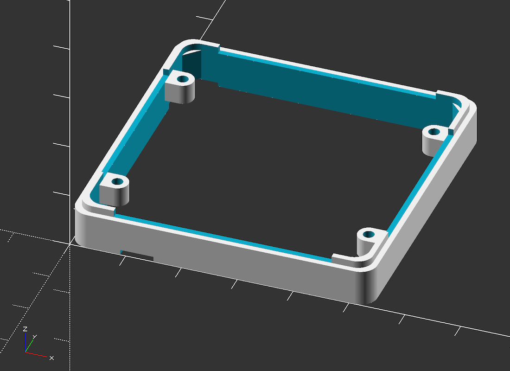
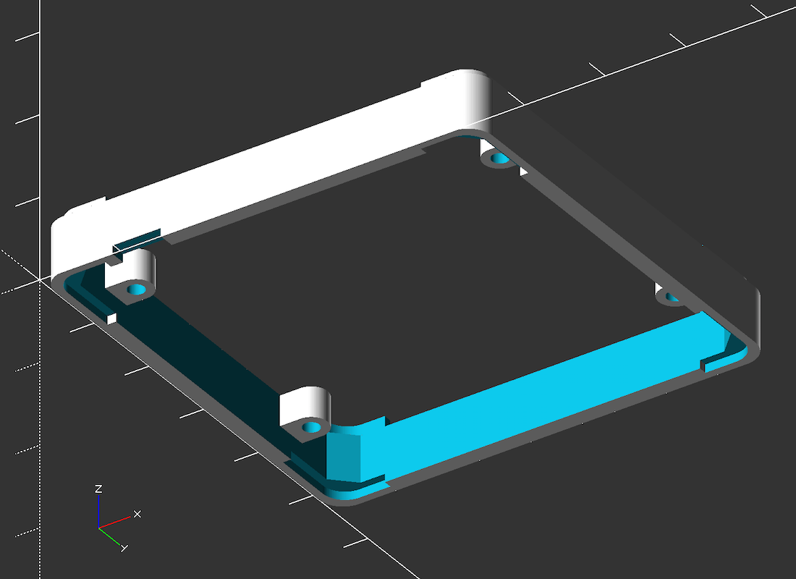
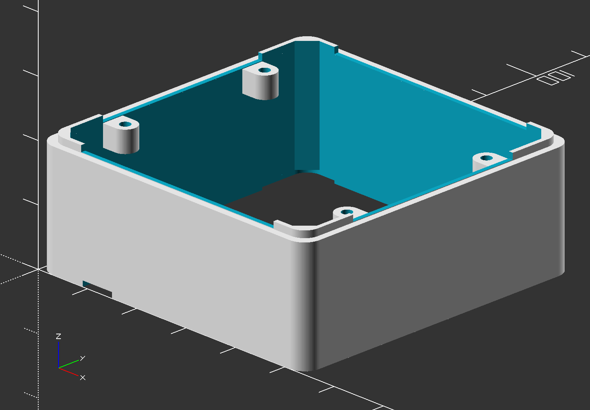
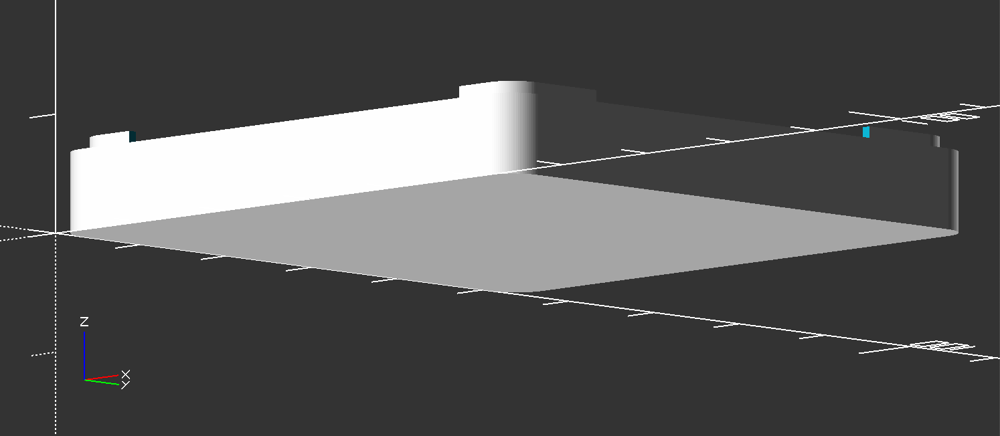

<div align="center">
  <h1>M5Stack Module</h1>
  <p>
    3D model and PCB blueprints for custom M5Stack modules.
  </p>
</div>






# Custom Settings

## Enclosure Height

```openscad
enclosure_height = 6.8;
```

Place a number for height of an enclosure you want to build.




## Bottom Plate

```openscad
build_bottom_plate = true;
```

Set `true` to build a bottom plate for an enclosure.


