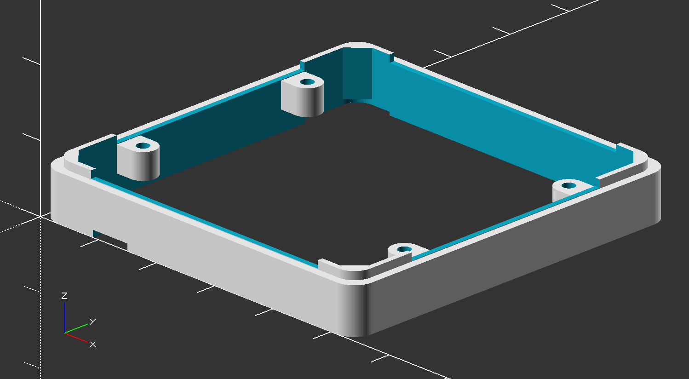

<div align="center">
  <h1>M5Stack <span style="font-weight: 100">Module</span></h1>
</div>

3D model and PCB blueprints for custom M5Stack modules.




# Custom Settings

## Enclosure Height

```openscad
enclosure_height = 6.8;
```

Place a number for height of an enclosure you want to build.


## Bottom Plate

```openscad
build_bottom_plate = true;
```

Set `true` to build a bottom plate for an enclosure.


