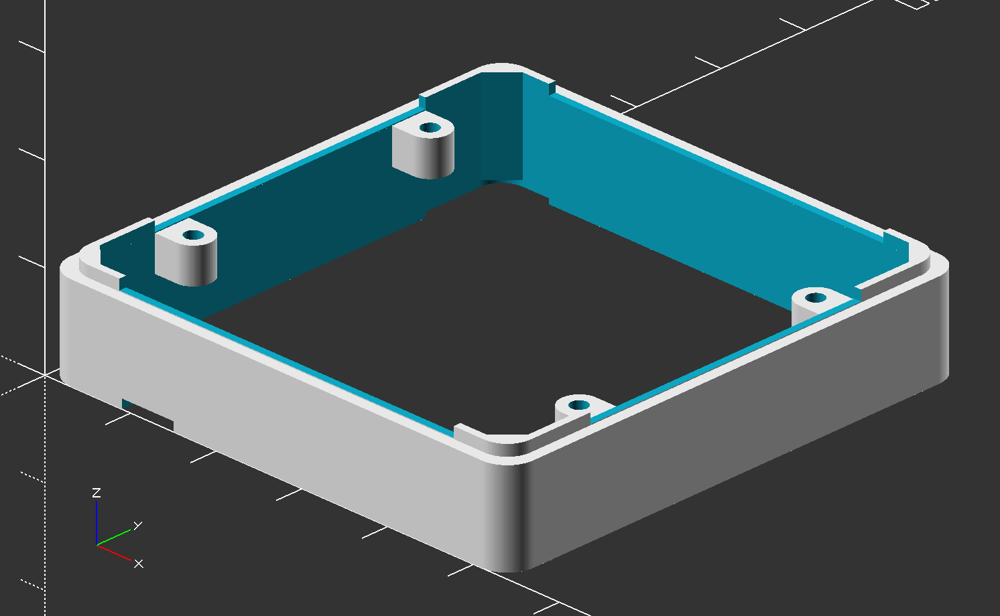

# M5Stack Module

3D model for custom M5Stack modules.


# Custom Settings

## Enclosure Height

```openscad
enclosure_height = 6.8;
```

Place a number for height of the enclosure you want to build.




## Bottom Plate

```openscad
build_bottom_plate = true;
```

Set `true` or `false ` for building bottom plate for a enclosure.

